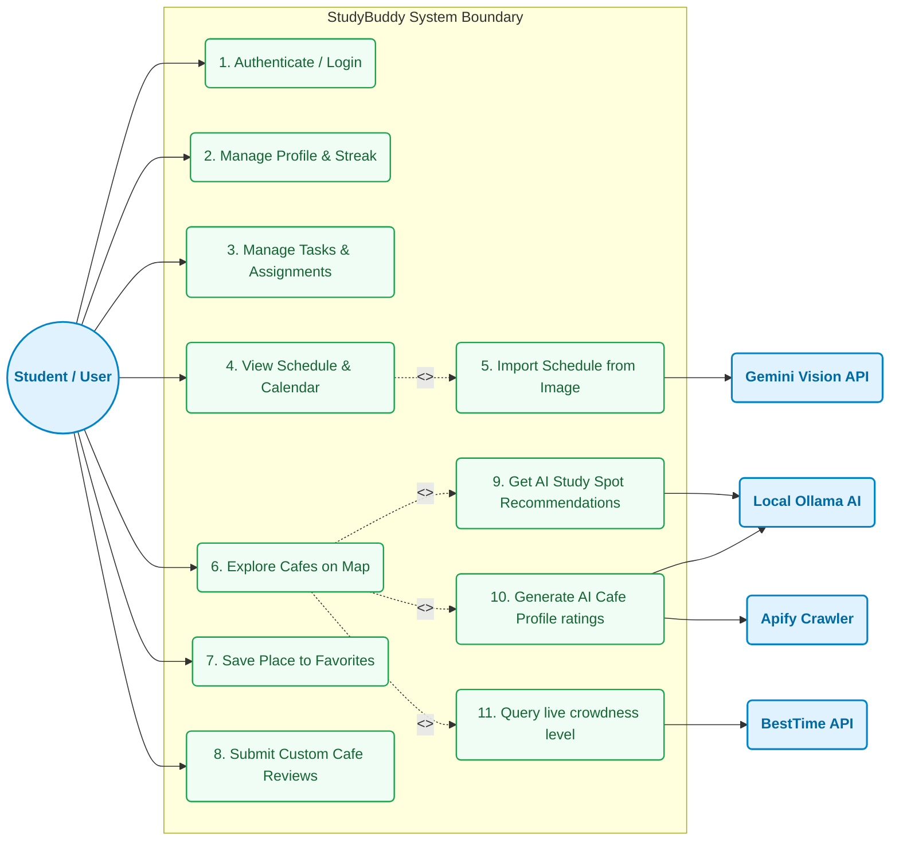
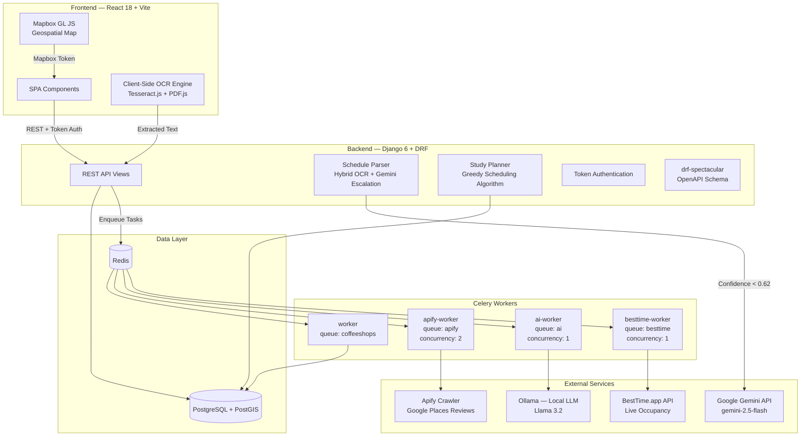
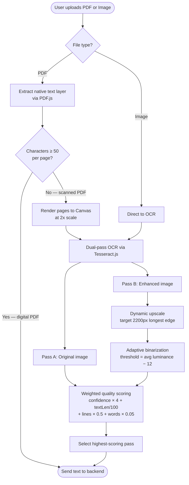
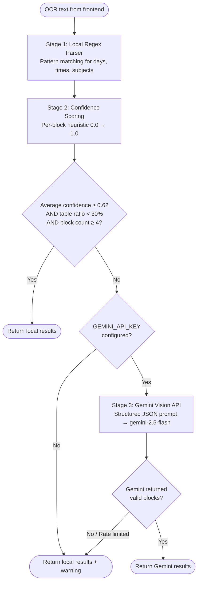
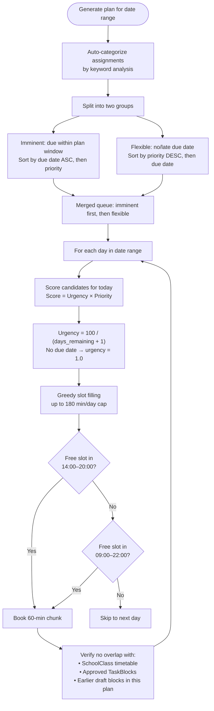
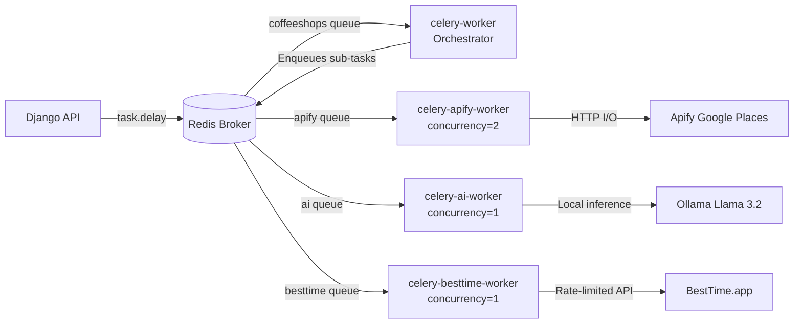
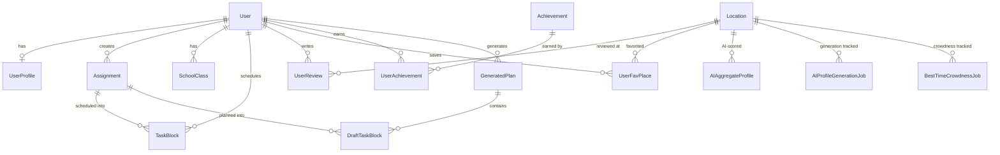

# StudyBuddy

StudyBuddy is a full-stack academic productivity platform that helps university students organize their coursework, automatically generate optimized study plans, and discover the best nearby study spots using AI-powered scoring and real-time occupancy data.

---
## User Use Case Diagram

The following diagram illustrates how the student interacts with the StudyBuddy system, along with the automated workflows handled by the AI agents and external APIs:



## System Architecture



### Tech Stack

| Layer | Technology | Role |
|:---|:---|:---|
| Frontend | React 18, Vite, Tailwind CSS 4 | SPA with client-side OCR and interactive map |
| Backend | Django 6.0, Django REST Framework, drf-spectacular | REST API, business logic, OpenAPI docs |
| Database | PostgreSQL 17 + PostGIS 3.4 | Relational data + geospatial indexing (SRID 4326) |
| Async | Celery 5.5 + Redis 7 | Distributed task queues with per-queue concurrency |
| Static | WhiteNoise | Compressed static file serving |
| Containerization | Docker Compose | Multi-service orchestration (8 containers) |

---

## AI Agents & Services

StudyBuddy incorporates specialized AI agents to automate data processing and provide intelligent study support:

1. **AI Review & Profile Analyzer (Local LLM)**
   - **Engine:** Local Ollama instance (defaulting to the `llama3.2` model).
   - **Role:** Analyzes raw Google Reviews scraped for a café to evaluate study-friendly parameters. It outputs structured ratings (0.0 to 5.0) for *Laptop Friendliness*, *Study Friendliness*, and *Noise Level*, along with a short 180-220 character summary in English.
   - **Queue:** Processed asynchronously via the `ai-worker` service (Celery `ai` queue).

2. **AI Study Recommender Agent (Local LLM)**
   - **Engine:** Local Ollama instance (`llama3.2`).
   - **Role:** Generates study spot recommendations tailored to the user. It evaluates nearby cafes based on:
     - Active assignments/tasks (title, description, category, and estimated duration).
     - User mood or specific request notes (e.g., "near campus", "quiet with multiple outlets").
   - It outputs the top 3 study spots ordered by relevance, with custom, user-friendly reasons.

3. **Intelligent Schedule Parser (Hybrid OCR + Gemini Vision)**
   - **Engine:** Local Hybrid OCR parser with automatic escalation to **Google Gemini Vision API** (defaulting to `gemini-2.5-flash`).
   - **Role:** Processes uploaded image schedules. If the local parser registers low extraction confidence (threshold < 0.62) or detects a complex table-heavy layout, it escalates processing to Gemini Vision to accurately structure academic time blocks.


## Core Features — Technical Deep-Dive

### 1. Client-Side OCR Pipeline

The frontend handles document preprocessing entirely in the browser before sending extracted text to the backend. This avoids uploading raw files to the server and reduces API latency.



**Key implementation details:**
- **Dual-pass strategy**: Every image is OCR'd twice — once raw, once with preprocessing (dynamic upscaling + adaptive contrast binarization). The pass with the highest composite quality score wins.
- **PDF hybrid extraction**: Digital PDFs use native text extraction via `pdfjs-dist`. Only pages with insufficient text (< 50 chars) are rendered to canvas and run through Tesseract.js.
- **Preprocessing algorithm**: Computes per-pixel luminance (`0.2126R + 0.7152G + 0.0722B`), calculates an adaptive threshold from the image's average luminance, and binarizes at 1.35× contrast.

### 2. Schedule Parser — Hybrid OCR with Gemini Escalation

The backend `ScheduleParser` extracts structured schedule blocks from raw OCR text using a tiered approach:



**Confidence scoring formula** (per block):
- `time_score` (60% weight): 1.0 if both start+end times present, 0.5 if only start, 0.0 if none
- `day_score` (25% weight): 1.0 for weekdays, 0.0 for weekends
- `title_score` (15% weight): proportional to title length (capped at 20 chars)
- Table-origin blocks receive a 0.65× penalty; fragmented rows get an additional 0.6× penalty

**Escalation triggers:**
- Average confidence < `0.62` (configurable via `GEMINI_ESCALATION_CONFIDENCE_THRESHOLD`)
- Table-heavy layout (≥ 30% of blocks extracted via table heuristics)
- Fewer than 4 blocks extracted (configurable via `GEMINI_ESCALATION_MIN_BLOCKS`)

### 3. Smart Study Planner — Greedy Scheduling Algorithm

The planner generates optimized study plans by distributing incomplete assignments across a date range while respecting class schedules and avoiding conflicts.



**Algorithm characteristics:**
- **Two-tier sorting**: Imminent items (deadline within plan window) are scheduled first, flexible items fill remaining capacity
- **Urgency-priority scoring**: `Score = (100 / (days_remaining + 1)) × priority` — assignments due tomorrow score 50× higher than those due in two months
- **Chunking**: Large assignments are broken into 60-minute blocks across multiple days to prevent fatigue
- **Cramming mode**: When an assignment is due within 1 day, the per-day chunk limit is bypassed (up to the full 180-minute daily cap)
- **Conflict avoidance**: Every proposed slot is validated against the student's recurring class schedule, existing task blocks, and previously generated draft blocks in the same plan

### 4. Multi-Queue Celery Worker Architecture

Background processing is split across four dedicated Celery queues, each tuned for its specific workload:



| Queue | Worker | Concurrency | Bottleneck Type | What It Does |
|:---|:---|:---|:---|:---|
| `coffeeshops` | `celery-worker` | default | General | Orchestrates the AI profile pipeline, dispatches sub-tasks |
| `apify` | `celery-apify-worker` | 2 | I/O-bound (HTTP wait) | Crawls Google Places reviews via Apify actors |
| `ai` | `celery-ai-worker` | 1 | CPU/RAM-bound | Scores reviews & generates AI profiles via Ollama (Llama 3.2) |
| `besttime` | `celery-besttime-worker` | 1 | Rate-limited API | Fetches live occupancy forecasts from BestTime.app |

**Why concurrency=1 on the AI queue?** Running local LLM inference (Ollama) is CPU/RAM-intensive. Concurrent inference would cause thread thrashing and OOM kills. Serializing to a single worker ensures stable execution.

### 5. Geospatial Engine

Study locations are stored with PostGIS `PointField` coordinates (SRID 4326 / WGS 84). The frontend renders locations on an interactive Mapbox GL JS map with:
- Real-time filtering by AI-scored attributes (study-friendly, laptop-friendly, noise level)
- User favorites with custom notes
- Per-location review system with weighted overall ratings
- Live crowdness indicators from BestTime.app

### 6. Gamification — Streaks & Achievements

The streak engine (`app/utils.py`) recalculates on every dashboard visit:
- Tracks consecutive study days using the student's configured timezone
- Accumulates `total_study_hours` from completed `TaskBlock` durations
- Awards achievements based on rule triggers (e.g., "First Step" for 1 completed block, "Academic Beast" for 5 sessions in one day, "Night Owl" for sessions ending after 22:00)

---

## Data Model Overview



---

## Project Structure

```
├── backend/
│   ├── app/                   # UserProfile, Assignment, SchoolClass, TaskBlock,
│   │                          # Achievement models; auth views; streak engine
│   ├── coffeeshops/           # Location, UserReview, UserFavPlace,
│   │   │                      # AIAggregateProfile models; Celery tasks
│   │   └── services/          # ai_profile_service (Ollama integration)
│   │                          # ai_study_recommender (mood/assignment matching)
│   │                          # apify_reviews, apify_places, google_places
│   ├── schedule/              # GeneratedPlan, DraftTaskBlock models
│   │   └── services/          # schedule_parser (hybrid OCR + Gemini)
│   │                          # planner (greedy scheduling algorithm)
│   │                          # assignment_parser (Gemini text extraction)
│   └── core/                  # Django settings, Celery config, URL routing
├── frontend/
│   └── assets/
│       ├── javascript/
│       │   ├── components/    # PlacesMap, Schedule, Planner, TaskForm,
│       │   │                  # Achievements, AIStudyFinder, etc.
│       │   ├── api/           # REST client (openapi-fetch)
│       │   └── utils/         # ocrService.js (Tesseract.js + PDF.js)
│       └── styles/
├── compose.yaml               # 8 services: db, redis, web, vite,
│                              # worker, apify-worker, ai-worker, besttime-worker
└── README.md
```

---

## API Overview

| Endpoint Group | Routes | Auth | Description |
|:---|:---|:---|:---|
| Auth | `POST /api/register/`, `POST /api/login/` | Public | Registration + token-based login |
| User | `GET /api/me/`, `GET/PUT /api/me/profile/` | Token | Profile, streak, study hours |
| Assignments | `GET/POST /api/schedule/assignments/` | Token | CRUD for academic tasks |
| Schedule | `POST /api/schedule/parse/` | Token | OCR text → parsed schedule blocks |
| Planner | `POST /api/schedule/planner/generate/` | Token | Generate draft study plan |
| Planner Approval | `POST /api/schedule/planner/{id}/approve/` | Token | Approve draft → create TaskBlocks |
| Locations | `GET /api/coffeeshops/map/` | Public | All locations with coordinates + profiles |
| Reviews | `GET/POST /api/coffeeshops/{id}/reviews/` | Mixed | Per-location reviews (public read, auth write) |
| AI Profile | `POST /api/coffeeshops/{id}/generate-ai-profile/` | Token | Trigger async AI scoring pipeline |
| AI Recommend | `POST /api/coffeeshops/ai-recommend/mood/` | Token | AI-powered study spot by mood |
| Crowdness | `POST /api/coffeeshops/{id}/besttime/generate/` | Token | Trigger BestTime occupancy fetch |
| Achievements | `GET /api/achievements/` | Token | List all achievements with status |
| OpenAPI | `GET /api/schema/`, `GET /api/schema/redoc/` | Public | Auto-generated spec via drf-spectacular |

---

## Relevant Environment Variables

Minimum required for backend:

- `DJANGO_SECRET_KEY`
- `DEBUG`
- `DJANGO_ALLOWED_HOSTS`
- `DATABASE_ENGINE`
- `DATABASE_NAME`
- `DATABASE_USERNAME`
- `DATABASE_PASSWORD`
- `DATABASE_HOST`
- `DATABASE_PORT`

Optional integrations:

- `GEMINI_API_KEY`, `GEMINI_MODEL`, `GEMINI_ESCALATION_CONFIDENCE_THRESHOLD`
- `APIFY_API_TOKEN`, `APIFY_REVIEWS_ACTOR_ID`, `APIFY_MAX_REVIEWS_PER_PLACE`
- `OLLAMA_HOST`, `OLLAMA_MODEL`
- `VITE_MAPBOX_ACCESS_TOKEN` (frontend map)

---

## Quick Setup (Docker, recommended)

1. Create a `.env` file in the project root:
   ```bash
   cp .env.example .env
   ```

2. Start the stack:
   ```bash
   docker compose up -d --build
   ```

3. Run migrations:
   ```bash
   docker compose exec web python manage.py makemigrations
   docker compose exec web python manage.py migrate
   ```

4. (Optional) create an admin user:
   ```bash
   docker compose exec web python manage.py createsuperuser
   ```

Useful URLs:

- App/API: `http://localhost:8000/`
- Admin: `http://localhost:8000/admin/`
- Frontend dev (Vite): `http://localhost:5173/`
- OpenAPI: `http://localhost:8000/api/schema/`
- ReDoc: `http://localhost:8000/api/schema/redoc/`

For detailed Docker troubleshooting and operations, see `README.Docker.md`.

## Local Setup (without Docker)

Prerequisites:

- Python 3.11+
- Node.js 20+
- PostgreSQL + PostGIS extension
- Redis

Backend:

```bash
cd backend
python -m venv .venv
source .venv/bin/activate
pip install -r requirements.txt
```

Important: local Django commands run from `backend/` do not automatically load the root `.env` file. Run `source ../.env` (or export variables manually) before using `manage.py`.

Frontend:

```bash
cd frontend
npm install
npm run dev
```

## Useful Commands

```bash
# backend logs
docker compose logs -f web

# service status
docker compose ps

# regenerate OpenAPI schema in container
docker compose exec web python manage.py spectacular --file /app/openapi-schema.yaml --validate

# regenerate frontend API types
docker compose exec vite npm run gen:api
```

## Testing

```bash
# backend tests (54 tests)
docker compose exec web python manage.py test
```

For local runs, the equivalent command is `python manage.py test` in `backend/` with environment variables already loaded.
